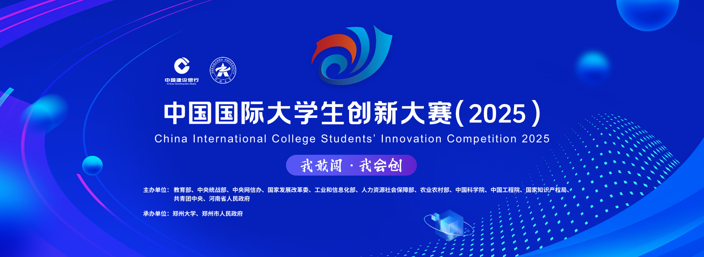

<div align="center">

# ❄️ 雪景智判一张图

**SkiOneMap — AI 驱动的滑雪场安全监控与事故智能定责平台**

[](LICENSE)[](https://vuejs.org/)
[](https://spring.io/projects/spring-boot)[](https://fastapi.tiangolo.com/)
[](https://threejs.org/)

> 让每一片雪坡，都有 AI 的眼睛。

</div>

---

## 📖 项目起源

本项目源于一项针对**国内滑雪场安全事故频发、责任认定难**问题的研究性课题。

2024 年，团队以"元雪迹——更符合当代年轻人的滑雪社交平台"为课题申报**大学生创新创业训练计划（大创）**，并于结项时获评 **2024 年大创省级优秀结项**（[查看结项公示](https://cxcyxy.zjku.edu.cn/col/1739865561363/2025/05/23/1747966174383.html)）。

在大创阶段的技术积累基础上，团队进一步将系统升级为完整的**数字孪生 **工程化平台，并以此参加 **2025 年"互联网+"大学生创新创业大赛**，荣获 **河北省铜奖**：

<p align="center">
  
</p>

---

## ✨ 业务亮点

| 亮点 | 说明 |
|------|------|
| 🗺️ **雪场数字孪生大屏** | 基于 Three.js + 真实 GLB 模型，3D 全景展示雪场，支持缩放旋转，摄像头位置实时标注 |
| 📷 **摄像头全生命周期管理** | 后台配置摄像头 3D 坐标与状态，一张图动态呈现所有在线/离线摄像头 |
| 🎥 **事故视频一键上传分析** | 向指定摄像头上传事故视频，自动触发 AI 分析任务，WebSocket 实时推送进度 |
| 🤖 **AI 行为识别** | YOLOv8 检测逆行、超速、碰撞风险、静止预警等高危行为，帧级精准定位 |
| ⚖️ **智能定责引擎** | RAG（LlamaIndex）结合《FIS 国际雪联规则》等知识库，秒级生成责任比例 + 法律条文依据 |
| 🌤️ **实时天气接入** | 接入国家气象局接口，顶部导航栏实时展示雪场所在地天气、温度、风力 |
| 📊 **6 大数据面板** | 事故定责列表、预警统计、摄像头状态、雪道安全指数、分析汇总、实时轨迹监控 |
| 🔐 **全路由鉴权** | 访问大屏与后台均需登录，session 级 token 验证，每次访问前自动清除旧凭证 |

---

## 🏗️ 系统架构

```
┌─────────────────────────────────────────────────────┐
│                   浏览器 / 大屏终端                   │
│    Vue 3 + Three.js + Vite  (port 9095)              │
│    ┌───────────┐  ┌──────────┐  ┌────────────────┐  │
│    │  3D 场景  │  │ 6大面板  │  │ 后台管理(admin) │  │
│    └───────────┘  └──────────┘  └────────────────┘  │
└──────────────┬──────────────────────────┬────────────┘
               │ REST + WebSocket          │ /weather 代理
               ▼                          ▼
┌──────────────────────┐      ┌──────────────────────┐
│   Spring Boot 3      │      │  国家气象局接口        │
│   (port 8085)        │      │  t.weather.sojson.com │
│  ┌────────────────┐  │      └──────────────────────┘
│  │  Task 任务调度  │  │
│  │  Video 管理     │  │
│  │  Scene/Camera  │  │
│  │  Auth 鉴权      │  │
│  └───────┬────────┘  │
│          │ Redis Pub  │
└──────────┼───────────┘
           ▼
┌──────────────────────┐      ┌──────────────────────┐
│   FastAPI AI Engine  │      │     MySQL 8.0         │
│   (port 8001)        │      │     ski_db            │
│  ┌────────────────┐  │      │  videos / tasks       │
│  │  YOLOv8 推理   │  │      │  alerts / cameras     │
│  │  LlamaIndex RAG│  │      │  scene_config / users │
│  └────────────────┘  │      └──────────────────────┘
└──────────────────────┘
```

### 模块说明

| 模块 | 技术栈 | 职责 |
|------|--------|------|
| `frontend` | Vue 3 · Vite · Three.js · Pinia · ECharts | 智慧大屏 + 后台管理 SPA |
| `backend` | Spring Boot 3 · MySQL · Redis · WebSocket | 业务逻辑、任务调度、鉴权、实时推送 |
| `ai-engine` | FastAPI · YOLOv8 · LlamaIndex · ChromaDB | 视频分析、行为识别、RAG 定责 |

---

## 🚀 快速启动（Docker Compose）

**前置条件：** Docker ≥ 20.x、Docker Compose ≥ 2.x

```bash
# 1. 克隆仓库
git clone https://github.com/ThisIsLittleSky/ski-one-map.git
cd ski-one-map

# 2. 配置 OpenAI API Key（用于 RAG 定责）
export OPENAI_API_KEY=your_key_here
# Windows PowerShell:
# $env:OPENAI_API_KEY="your_key_here"

# 3. 一键启动全栈服务
docker-compose up -d

# 4. 访问智慧大屏
open http://localhost:9095
```

> 默认账号：`admin` / 密码：`admin123`（首次登录后建议修改）

服务端口一览：

| 服务 | 地址 |
|------|------|
| 智慧大屏 / 后台管理 | http://localhost:9095 |
| Spring Boot API | http://localhost:8085 |
| AI 引擎 | http://localhost:8001 |
| MySQL | localhost:3306 |
| Redis | localhost:6379 |

---

## 🛠️ 源码启动（开发模式）

### 环境要求

- Node.js ≥ 18
- JDK 17+
- Python 3.10+
- MySQL 8.0、Redis 7

### 1. 前端

```bash
cd frontend
npm install
npm run dev
# 访问 http://localhost:9095
```

### 2. 后端

```bash
cd backend
# 修改 src/main/resources/application.yml 中数据库 / Redis 连接信息
./mvnw spring-boot:run
```

### 3. AI 引擎

```bash
cd ai-engine
pip install -r requirements.txt
export OPENAI_API_KEY=your_key_here
uvicorn main:app --host 0.0.0.0 --port 8001 --reload
```

### 4. 数据库初始化

```bash
mysql -u root -p ski_db < docker/mysql/init.sql
```

---

## 📁 目录结构

```
ski/
├── frontend/               # Vue 3 前端
│   ├── src/
│   │   ├── views/          # 页面（大屏、登录、后台各模块）
│   │   ├── components/     # 组件（3D场景、天气、6大面板）
│   │   ├── stores/         # Pinia 状态（alertStore）
│   │   ├── api/            # Axios 封装
│   │   └── router/         # 路由（全路由鉴权）
│   ├── public/
│   │   └── 7秒换视角.glb   # 雪场 3D 模型
│   └── nginx.conf          # 生产环境 Nginx 配置
├── backend/                # Spring Boot 后端
│   └── src/main/java/com/ski/monitor/
│       ├── controller/     # REST API
│       ├── service/        # 业务逻辑
│       ├── entity/         # JPA 实体
│       └── repository/     # 数据访问
├── ai-engine/              # FastAPI AI 服务
├── docker/                 # Docker 配置 & SQL 初始化
├── docker-compose.yml
└── docs/                   # 开发阶段报告
```

---

## 🎯 核心功能演示流程

1. **登录** → 进入智慧大屏，查看雪场 3D 全景与实时天气
2. **后台管理 → 场地配置** → 设置 3D 建模四角经纬度 & 天气城市编码
3. **后台管理 → 摄像头管理** → 添加摄像头（设置 3D 坐标），大屏实时标注
4. **摄像头行 → 上传视频** → 选择事故视频上传，AI 自动分析
5. **大屏左上角** → 事故智能定责面板，实时显示责任比例 & 法律条文依据
6. **大屏各面板** → 预警统计、安全指数、轨迹监控等实时联动

---

## 🗂️ 数据库 ER 简图

```
users ──┐
        ├── videos ──── tasks ──── alerts
cameras ─┘
scene_config
```

---

## 📜 开源协议

本项目基于 [MIT License](LICENSE) 开源。

---

<div align="center">
**© 2026 ThisIsLittleSky**

</div>
