<div align="center">

# ❄️ 雪境智判一张图

**SkiOneMap — AI 驱动的滑雪场安全监控与事故智能定责平台**

[](LICENSE)[](https://vuejs.org/)
[](https://spring.io/projects/spring-boot)[](https://fastapi.tiangolo.com/)
[](https://threejs.org/)

> 通过”一张图“，掌控雪场事故、实时分析

</div>

---

## 📖 项目起源

2024 年，团队以"元雪迹——更符合当代年轻人的滑雪社交平台"为课题申报**大学生创新创业训练计划（大创）**，并于结项时获评 **2024 年大创省级优秀结项**（[查看结项公示](https://cxcyxy.zjku.edu.cn/col/1739865561363/2025/05/23/1747966174383.html)）。

在大创阶段的技术积累基础上，团队进一步将系统升级为完整的 **数字孪生 **工程化平台，并从小的出发点开始，开始做资源整合 **以滑雪事故量化定则为主题，打造“硬件-软件-法规分析“的全链路商业模式**，此项目为软件部分。


---

## ✨ 业务亮点

| 亮点 | 说明 |
|------|------|
| 🗺️ **雪场数字孪生大屏** | 基于 Three.js + 真实 GLB 模型，3D 全景展示雪场，支持缩放旋转，摄像头位置实时标注 |
| 📷 **摄像头全生命周期管理** | 后台配置摄像头 3D 坐标与状态，一张图动态呈现所有在线/离线摄像头 |
| 🎥 **事故视频一键上传分析** | 向指定摄像头上传事故视频，自动触发 AI 分析任务，WebSocket 实时推送进度 |
| 🤖 **AI 行为识别** | YOLOv8 检测逆行、超速、碰撞风险、静止预警等高危行为，帧级精准定位 |
| ⚖️ **智能定责引擎** | RAG（LlamaIndex）结合《FIS 国际雪联规则》等知识库，秒级生成责任比例 + 法律条文依据 |
| 🧭 **雪境智判-滑雪伴侣** | 提供事故救援（SOS）记录管理、现场辅助处置入口与安全服务联动能力 |
| 💬 **雪境智判-AI助手小雪** | 新增可视化知识库管理、测试查询、查询历史与性能统计，支持 RAG 流程优化与 Embedding 模式切换 |
| 👁 **雪境智判-天眼追踪** | 支持按人员追踪与按颜色搜索，结合行人重识别、外观分析与路线预测完成跨摄像头追踪 |
| 🌤️ **实时天气接入** | 接入国家气象局接口，顶部导航栏实时展示雪场所在地天气、温度、风力 |
| 📊 **6 大数据面板** | 事故定责列表、预警统计、摄像头状态、雪道安全指数、分析汇总、实时轨迹监控 |
| 🔐 **全路由鉴权** | 访问大屏与后台均需登录，session 级 token 验证，每次访问前自动清除旧凭证 |

---

## 🆕 最近更新

### 1. 雪境智判-滑雪伴侣

- 新增 **事故救援（SOS）记录管理页**，可查看事故发生时间、定位坐标、设备信息与处理状态
- 支持区分 **哨兵模式 / 普通模式**，便于运营人员快速识别高优先级求救事件
- 提供后台处置入口，帮助雪场形成从报警到处理的闭环留痕

---

### 2. 雪境智判-AI助手小雪

- 新增 **知识库管理工作台**，可直接上传 `.txt / .md / .pdf` 文档并在线预览
- 支持 **测试查询、责任占比可视化、参考文献展示、处理建议输出**
- 新增 **查询历史、性能统计、索引状态监控**
- 支持 **Embedding 模式开关** 与索引重建，RAG 调试与运维更加直观
- RAG 流程已优化为：
  - 视频分析场景下，根据预警事件与轨迹生成结构化定责建议
  - 问答场景下，支持直接对知识库进行检索增强回答
  - 当知识库或模型不可用时，自动回退到兜底逻辑，保证系统可用性

---

### 3. 雪境智判-天眼追踪

- 后台新增 **天眼追踪** 页面，可从预警记录一键跳转进入追踪流程
- 支持两种追踪方式：
  - **按人员追踪**：从源视频中提取目标人员后发起跨摄像头追踪
  - **按颜色搜索**：先按衣着颜色筛选候选目标，再进行人工确认
- AI 引擎新增：
  - **人员提取**：自动裁剪目标人物图像并生成追踪素材
  - **行人重识别**：跨视频匹配相同滑雪者
  - **外观分析**：输出目标人物服装/外观特征描述
  - **路线预测**：结合摄像头关系推断潜在去向
- 后端新增完整的 **追踪任务、追踪结果、追踪人员、任务摄像头** 数据模型与接口

---

## 🏗️ 系统架构

```
┌─────────────────────────────────────────────────────┐
│                   浏览器 / 大屏终端                   │
│    Vue 3 + Three.js + Vite  (port 9095)              │
│    ┌───────────┐  ┌──────────┐  ┌────────────────┐  │
│    │  3D 场景  │  │ 6大面板  │  │ 后台管理(admin) │  │
│    └───────────┘  └──────────┘  └────────────────┘  │
└──────────────┬──────────────────────────┬────────────┘
               │ REST + WebSocket          │ /weather 代理
               ▼                          ▼
┌──────────────────────┐      ┌──────────────────────┐
│   Spring Boot 3      │      │  国家气象局接口        │
│   (port 8085)        │      │  t.weather.sojson.com │
│  ┌────────────────┐  │      └──────────────────────┘
│  │  Task 任务调度  │  │
│  │  Video 管理     │  │
│  │  Scene/Camera  │  │
│  │  Auth 鉴权      │  │
│  └───────┬────────┘  │
│          │ Redis Pub  │
└──────────┼───────────┘
           ▼
┌──────────────────────┐      ┌──────────────────────┐
│   FastAPI AI Engine  │      │     MySQL 8.0         │
│   (port 8001)        │      │     ski_db            │
│  ┌────────────────┐  │      │  videos / tasks       │
│  │  YOLOv8 推理   │  │      │  alerts / cameras     │
│  │  LlamaIndex RAG│  │      │  scene_config / users │
│  └────────────────┘  │      └──────────────────────┘
└──────────────────────┘
```

### 模块说明

| 模块 | 技术栈 | 职责 |
|------|--------|------|
| `frontend` | Vue 3 · Vite · Three.js · Pinia · ECharts | 智慧大屏 + 后台管理 SPA |
| `backend` | Spring Boot 3 · MySQL · Redis · WebSocket | 业务逻辑、任务调度、鉴权、实时推送 |
| `ai-engine` | FastAPI · YOLOv8 · LlamaIndex · ChromaDB | 视频分析、行为识别、RAG 定责 |

---

## ⚙️ 环境变量配置（必须提前设置）

在启动项目前，需要配置以下环境变量。**设置后必须重新打开终端才能生效。**

### Windows CMD（管理员权限）

```cmd
setx QWEN_API_KEY "your_qwen_api_key_here"
setx QWEN_BASE_URL "https://dashscope.aliyuncs.com/compatible-mode/v1"
setx QWEN_LLM_MODEL "qwen3-max-2026-01-23"
setx QWEN_EMBEDDING_MODEL "text-embedding-v4"
setx USE_EMBEDDING "true"
```

### Windows PowerShell（管理员权限）

```powershell
[Environment]::SetEnvironmentVariable("QWEN_API_KEY", "your_qwen_api_key_here", "User")
[Environment]::SetEnvironmentVariable("QWEN_BASE_URL", "https://dashscope.aliyuncs.com/compatible-mode/v1", "User")
[Environment]::SetEnvironmentVariable("QWEN_LLM_MODEL", "qwen3-max-2026-01-23", "User")
[Environment]::SetEnvironmentVariable("QWEN_EMBEDDING_MODEL", "text-embedding-v4", "User")
[Environment]::SetEnvironmentVariable("USE_EMBEDDING", "true", "User")
```

### Linux / macOS

将以下内容添加到 `~/.bashrc` 或 `~/.zshrc`：

```bash
export QWEN_API_KEY=your_qwen_api_key_here
export QWEN_BASE_URL=https://dashscope.aliyuncs.com/compatible-mode/v1
export QWEN_LLM_MODEL=qwen3-max-2026-01-23
export QWEN_EMBEDDING_MODEL=text-embedding-v4
export USE_EMBEDDING=true
```

然后执行 `source ~/.bashrc` 或 `source ~/.zshrc` 使其生效。

---

## 🚀 快速启动（Docker Compose）

**前置条件：** Docker ≥ 20.x、Docker Compose ≥ 2.x

```bash
# 1. 克隆仓库
git clone https://github.com/ThisIsLittleSky/ski-one-map.git
cd ski-one-map

# 2. 配置环境变量（参考上方"环境变量配置"章节）

# 3. 一键启动全栈服务
docker-compose up -d

# 4. 访问智慧大屏
open http://localhost:9095
```

> 默认账号：`admin` / 密码：`admin123`（首次登录后建议修改）

服务端口一览：

| 服务 | 地址 |
|------|------|
| 智慧大屏 / 后台管理 | http://localhost:9095 |
| Spring Boot API | http://localhost:8085 |
| AI 引擎 | http://localhost:8001 |
| MySQL | localhost:3306 |
| Redis | localhost:6379 |

---

## 🛠️ 源码启动（开发模式）

### 环境要求

- Node.js ≥ 18
- JDK 17+
- Python 3.10+
- MySQL 8.0、Redis 7

### 1. 前端

```bash
cd frontend
npm install
npm run dev
# 访问 http://localhost:9095
```

### 2. 后端

```bash
cd backend
# 修改 src/main/resources/application.yml 中数据库 / Redis 连接信息
./mvnw spring-boot:run
```

### 3. AI 引擎

```bash
cd ai-engine
conda env remove -n ski-ai
conda env create -f environment.yml
conda activate ski-ai
pip install -i https://pypi.org/simple --no-cache-dir -r requirements.txt

# 确保已按照"环境变量配置"章节设置环境变量，并重新打开终端
uvicorn app.main:app --host 0.0.0.0 --port 8001 --reload
```

### 4. 数据库初始化

```bash
mysql -u root -p ski_db < docker/mysql/init.sql
```

---

## 📁 目录结构

```
ski/
├── frontend/               # Vue 3 前端
│   ├── src/
│   │   ├── views/          # 页面（大屏、登录、后台各模块）
│   │   ├── components/     # 组件（3D场景、天气、6大面板）
│   │   ├── stores/         # Pinia 状态（alertStore）
│   │   ├── api/            # Axios 封装
│   │   └── router/         # 路由（全路由鉴权）
│   ├── public/
│   │   └── 7秒换视角.glb   # 雪场 3D 模型
│   └── nginx.conf          # 生产环境 Nginx 配置
├── backend/                # Spring Boot 后端
│   └── src/main/java/com/ski/monitor/
│       ├── controller/     # REST API
│       ├── service/        # 业务逻辑
│       ├── entity/         # JPA 实体
│       └── repository/     # 数据访问
├── ai-engine/              # FastAPI AI 服务
├── docker/                 # Docker 配置 & SQL 初始化
├── docker-compose.yml
└── docs/                   # 开发阶段报告
```

---

## 🎯 核心功能演示流程

1. **登录** → 进入智慧大屏，查看雪场 3D 全景与实时天气
2. **后台管理 → 场地配置** → 设置 3D 建模四角经纬度 & 天气城市编码
3. **后台管理 → 摄像头管理** → 添加摄像头（设置 3D 坐标），大屏实时标注
4. **摄像头行 → 上传视频** → 选择事故视频上传，AI 自动分析
5. **大屏左上角** → 事故智能定责面板，实时显示责任比例 & 法律条文依据
6. **后台管理 → AI 助手小雪** → 上传知识库、测试查询、查看历史与性能统计
7. **后台管理 → 天眼追踪** → 选择目标人员或颜色，发起跨摄像头追踪任务
8. **后台管理 → 事故救援** → 查看 SOS 求救记录并完成事件处置闭环
9. **大屏各面板** → 预警统计、安全指数、轨迹监控等实时联动

---

## 🖼️ 功能截图

### 智慧大屏总览

<p align="center">
  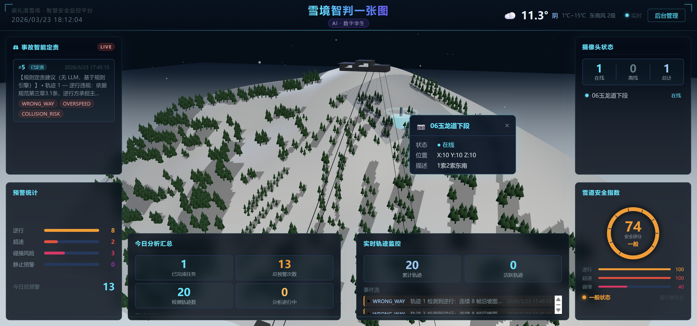
</p>

> 基于 Three.js 的雪场 3D 数字孪生大屏，集成事故定责面板、预警统计、摄像头状态、雪道安全指数等 6 大实时数据面板，并接入国家气象局实时天气。

---

### 后台管理模块

| 摄像头管理 | 事故视频管理 |
|:---:|:---:|
| 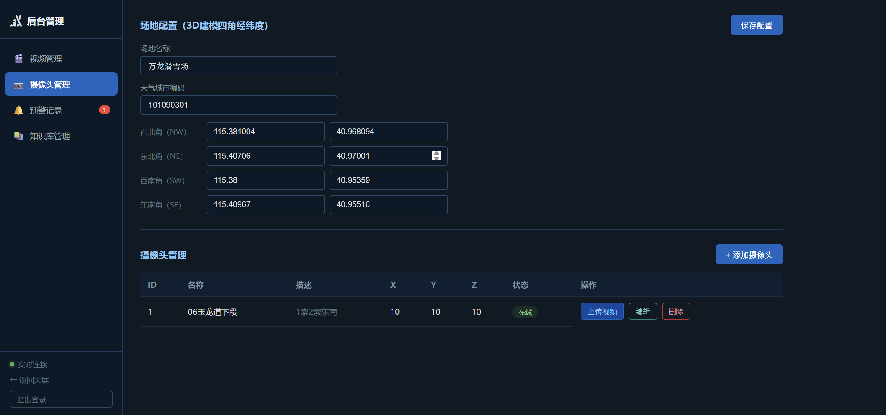 | 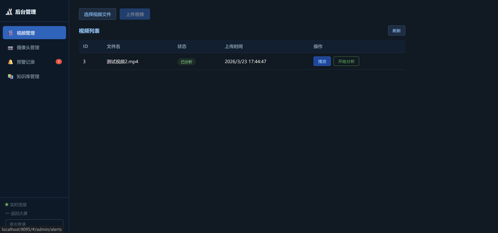 |

| 往期案例与雪联规则知识库 | 后台预警量化留痕 |
|:---:|:---:|
| 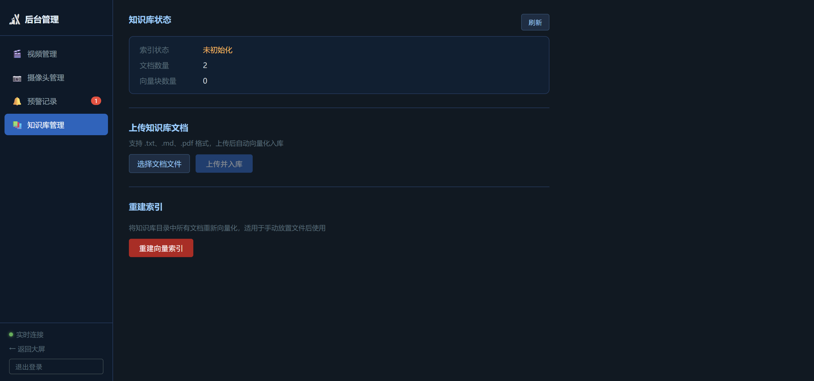 | 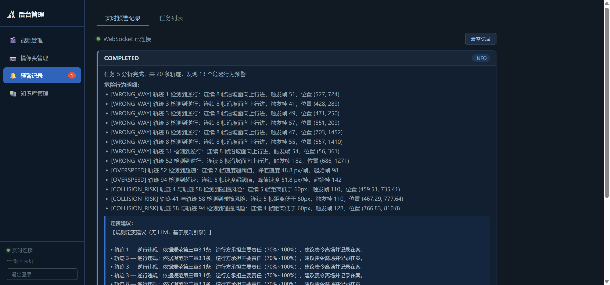 |

---

### 雪境智判-滑雪伴侣

<p align="center">
  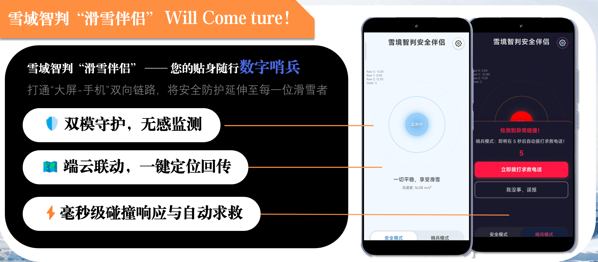
</p>
<p align="center">
  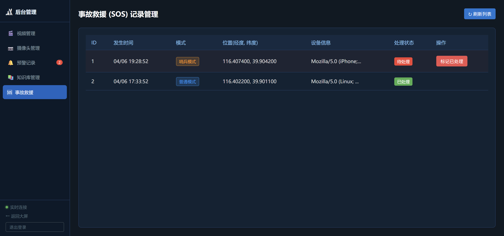
</p>


> 展示事故救援记录管理页，突出求救模式、定位信息、设备信息和处理状态，体现“滑雪伴侣”在应急响应中的辅助价值。

---

### 雪境智判-AI助手小雪

| 知识库管理总览 | 测试查询与结果展示 |
|:---:|:---:|
| 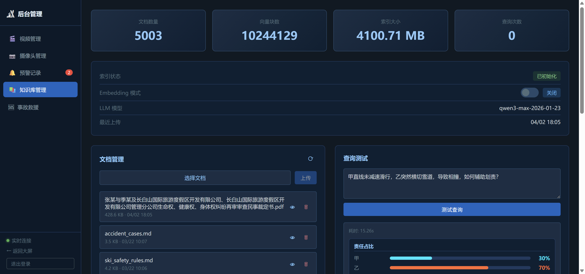 | 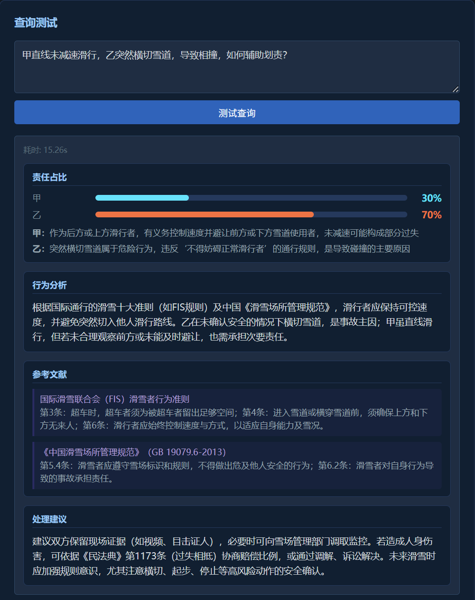 |

> 展示 AI 助手小雪的知识库运维、查询测试、责任占比可视化、参考文献引用与处理建议输出能力，突出优化后的 RAG 工作流。

---

### 雪境智判-天眼追踪

| 天眼追踪主界面 | 按颜色搜索候选目标 |
|:---:|:---:|
| 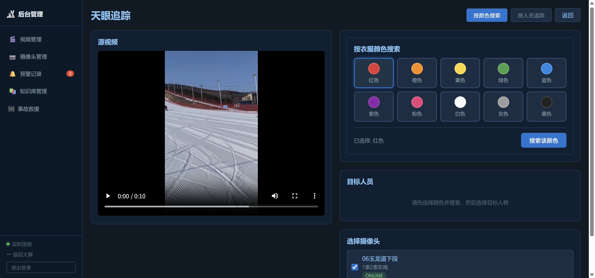 | 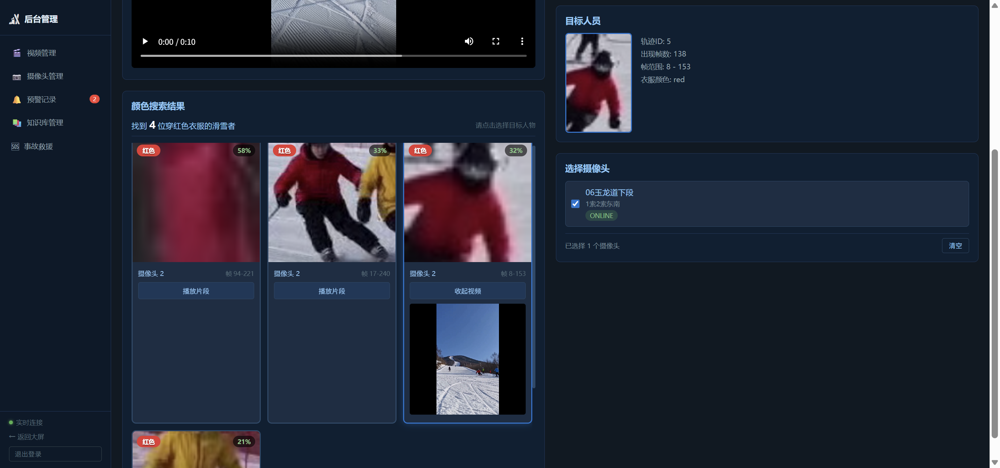 |


> 展示从源视频选人、颜色搜索、摄像头选择到追踪结果返回的完整流程，体现天眼追踪的跨摄像头检索与智能研判能力。

---

## ⚖️ 智能定责：AI 如何判断滑雪事故责任？

### 问题背景

滑雪场事故的责任认定长期面临"各说各有理"的困境。以最常见的**追尾碰撞**为例，争议焦点通常集中在以下三点：

| 争议点 | 说明 |
|--------|------|
| **横切幅度** | 前方滑雪者的转弯是正常 S 弯，还是突然横切？ |
| **有效制动** | 后方滑雪者是否已采取合理的刹车避让措施？ |
| **量化判别** | 是否有客观数据来替代双方各执一词的主观描述？ |

**典型场景对比：**

- **正常 S 弯**：前方雪友按标准 S 型路线滑行，属于正常行为，后方追尾则后方负主责。
- **突然横切**：前方雪友突然大幅横切道路，后方雪友即便制动也无法及时响应，责任应合理分摊。

传统事故处理依赖现场目击证词，主观性强、难以标准化，往往导致责任认定拖延数月甚至对簿公堂。

---

### AI 定责流程

当前版本的智能定责流程，已经从“单次检索回答”升级为“**视频行为分析 + RAG 检索增强 + 结构化结果兜底**”的组合链路，将主观争议尽量转化为可复核的结构化结论：

```
事故视频上传
      │
      ▼
 YOLOv8 视频分析
 ─────────────────────────────────────────
 · 检测滑雪者轨迹、速度变化、危险接近与异常行为
 · 识别逆行、碰撞风险、静止预警等事件
 · 产出 alerts + tracks 两类结构化数据
      │
      ▼
 行为特征结构化
 ─────────────────────────────────────────
 · 将预警事件、轨迹信息、时空位置整理为统一输入
 · 保留责任分析所需的关键行为证据
 · 为后续规则检索和大模型推理提供上下文
      │
      ▼
 RAG 检索增强 / 直接问答双路径
 ─────────────────────────────────────────
 路径 A：事故视频分析
 · 基于 alerts + tracks 构建定责 Prompt
 · 从 FIS 规则、案例库中检索相关条文与类案
 
 路径 B：AI 助手小雪问答
 · 用户直接输入问题
 · 系统执行知识库检索增强回答
 
 · 支持 Embedding 模式开关
 · 知识库未初始化时自动回退兜底逻辑
      │
      ▼
 LLM 生成结构化定责结果
 ─────────────────────────────────────────
 · liability：责任主体、责任比例、雪场连带责任
 · behavior_analysis：对关键行为的文字分析
 · references：引用规则条文/案例摘要
 · suggestion：后续处理建议
```

### 优化后的价值

| 能力 | 更新后效果 |
|------|------------|
| 视频定责 | 不再只依赖文本问答，而是直接基于视频分析结果生成责任建议 |
| 知识库问答 | AI 助手小雪可直接对规则库、案例库发起测试查询 |
| 系统稳定性 | 当索引未初始化、知识库为空或模型调用异常时，仍能返回兜底结果 |
| 运维可视化 | 后台可查看文档数量、索引大小、查询历史、性能统计与 Embedding 开关 |

### 知识库构成

| 知识库 | 内容 | 用途 |
|--------|------|------|
| FIS 国际雪联规则 | 10 条滑雪行为准则（制动义务、超越规则、路线选择等） | 提供行为合规性判断依据 |
| 往期司法判决 | 3000+国内外滑雪事故法院判决摘要 | 提供类案参考与责任比例参照 |


> 管理员可在后台直接维护知识库内容，新增规则文件或判决案例后，系统自动重建向量索引，无需重启服务。

---

## 🗂️ 数据库 ER 简图

```
users ───────────────┐
                     ▼
                  videos ────────────────┐
                     │                   │
                     │                   ▼
                     │                 tasks ─────── alerts
                     │
                     ├────────────── tracking_persons
                     │
                     └────────────── tracking_tasks ───── tracking_results
                                        │                     │
                                        │                     └────── cameras
                                        │
                                        └──── tracking_task_cameras ─── cameras

cameras ───────────────────────────────┘
scene_config
sos_record
```

### 实体关系说明

| 实体 | 说明 |
|------|------|
| `users` | 平台登录用户 |
| `videos` | 摄像头上传/关联的视频资源，关联用户与摄像头 |
| `tasks` | 常规 AI 分析任务 |
| `alerts` | AI 分析后生成的预警记录，关联分析任务 |
| `tracking_persons` | 从视频中提取出的候选追踪人物 |
| `tracking_tasks` | 天眼追踪任务主表，记录目标轨迹与任务状态 |
| `tracking_task_cameras` | 追踪任务与目标摄像头的多对多关系 |
| `tracking_results` | 天眼追踪返回结果，记录命中摄像头、视频、帧号、置信度、外观特征、路线预测 |
| `cameras` | 雪场摄像头信息与三维空间位置 |
| `scene_config` | 数字孪生场景配置 |
| `sos_record` | 滑雪伴侣上报的事故救援 / SOS 记录 |

---

## 📜 开源协议

本项目基于 [MIT License](LICENSE) 开源。

---

<div align="center">
**© 2026 ThisIsLittleSky**

</div>
